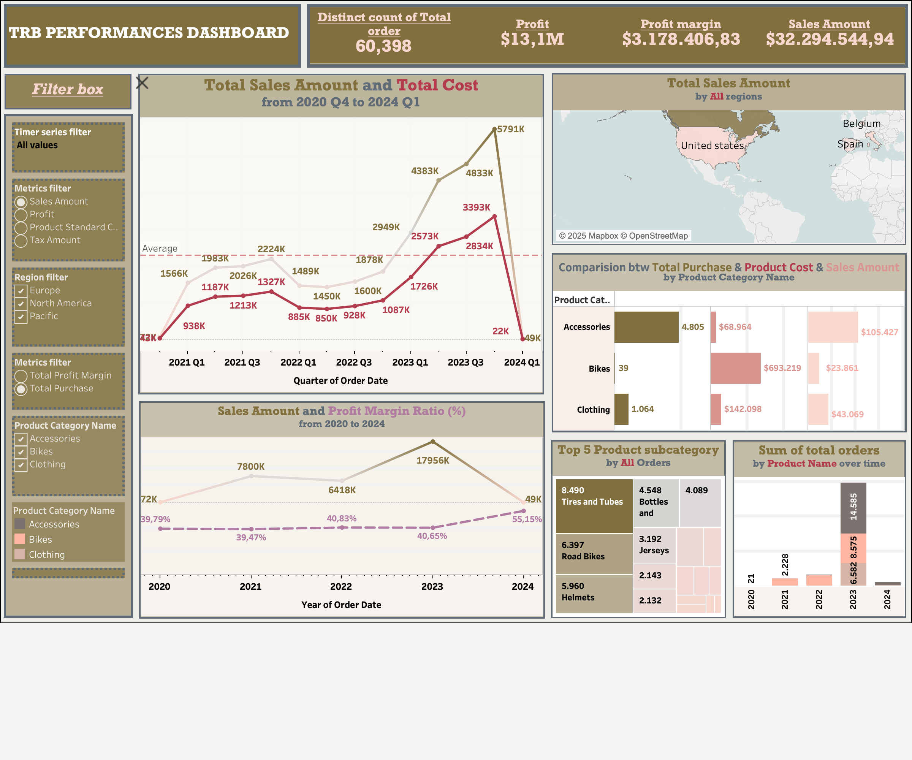
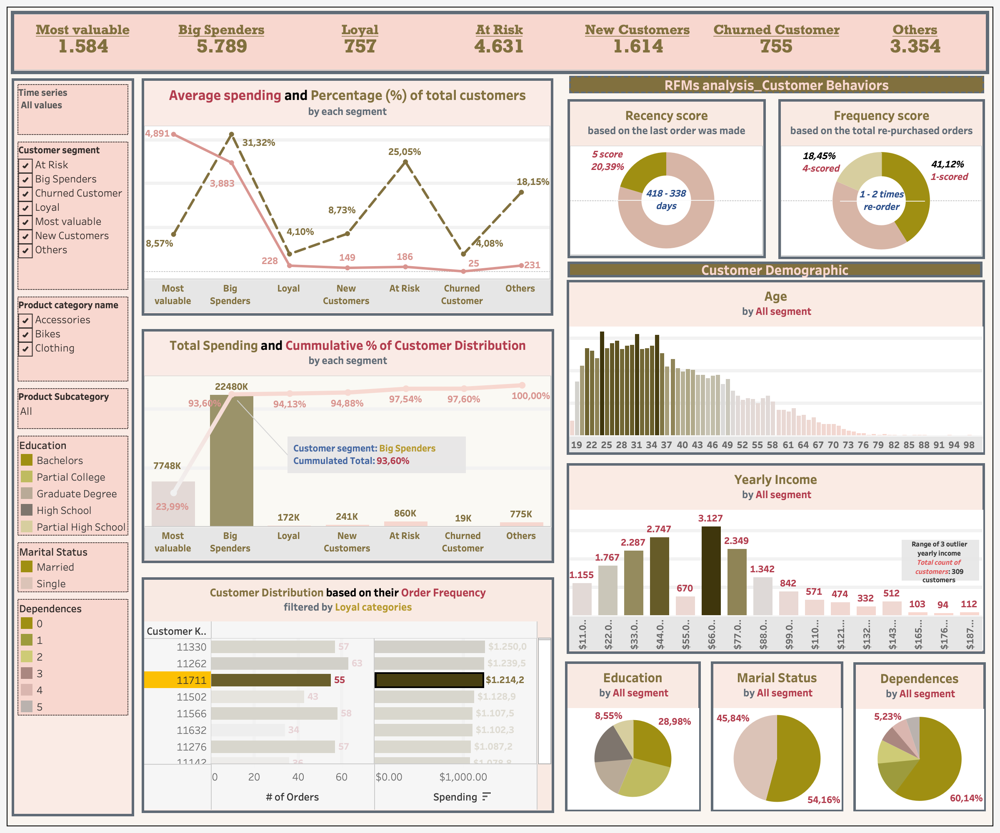

# TrueRide Bicycle (TRB) Performances and Customer Behavior

This repository presents a business analytics case study for TrueRide Bicycle, a local +40 year-old family-owned business in North America. Over the years, the company has grown significantly, offering a diverse range of bicycles, bike parts, and accessories, as well as sports apparel and biking-related equipment. The Project mainly focuses on analyzing sales performance, product profitability, customer behavior, and regional market performance to drive data-informed strategic decisions.

---

##  Project Goal 

- Provide data-driven insights on sales trends, customer segmentation, and product profitability 
- Identify high-value customer groups and assess their impact on total revenue 
- Develop actionable strategies for product, region, and customer engagement 
- Deliver interactive Tableau dashboards for executive and marketing use.

---

## Data Pipeline overview:

| **Data Source** | **Processing & Analysis (Python)**         | **Visualization & Output (Tableau)**                      |
|-----------------|---------------------------------------------|------------------------------------------------------------|
| ORDERS --->      | Clean & merge                              |                                                            |
| PRODUCTS     --->    | Trend analysis                             |                                                            |
| CUSTOMERS    --->    | RFM segmentation                           | Interactive dashboards for executives & marketing          |
| PROMOTIONS    --->   | Promo effectiveness insights               |                                                            |
|               | Final modeling / feature extraction (Python) |                                                            |

---

## The Features of project

- Sales & Revenue Visualization: Tableau Analyse for financial performance, product trends, and seasonal sales insights 
- Customer Behavior Segmentation: RFM analysis in Python to profile high-value and at-risk customer segments 
- Profitability metric Analysis: Identification of key revenue drivers and recommendations for optimizing low-performing product lines

---

## Tools and Workflow

- Python: Customer segmentation (RFM), exploratory data analysis, trend analysis 
- Tableau: Interactive dashboards for financial performance & product profitability visualization 
- Data Sources: Orders, Products, Customers, Promotions (Q1 2020 – Q1 2024)

---
### Key Insights 
- 2023 sales reached $7.4M (peak in Q4: $2.5M+ revenue); 2022 was most profitable due to cost efficiency 
- Canada & New Zealand are the strongest markets, while the US underperformed despite being the origin market 
- Most Valuable & Big Spenders (~39% of customers) generated 93.6% of total sales 
- Accessories & Components: accessories have high margins but low overall revenue; components incur costs without sales

---
### Recommendations
- Expand top-selling bike models and improve product quality 
- Leverage seasonal peaks (June & Q4) for promotions and campaigns 
- Focus resources on high-performing markets (Canada, New Zealand) and redesign US strategy Strengthen loyalty programs targeting high-value segments.
- Reposition Components as part of after-sales services, customer caring, etc.

---

## Files

- `Report`: Full TRB Bussiness Analytics Report (PDF based)
- `Notebooks`: Python script for EDA & RFM segmentation
- `Tableau`: Tableau packaged dashboards
- `Description and Files`: Context, Requirements, and original Dataset files (csv)
- `Image`: dashboard image (png)

### OVERAL PERFORMANCE DASHBOARD #1

### CUSTOMERS DEMOGRAPHIC AND BEHAVIOR ANALYSIS DASHBOARD #2

